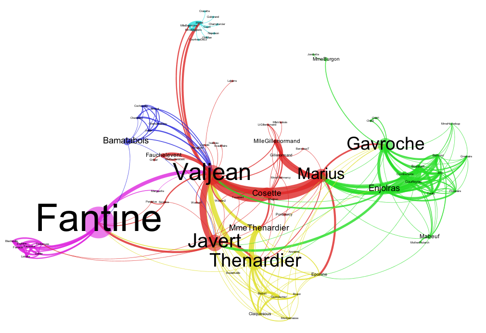

# CSC-270: Computational Approaches to the Humanities

This course aims to teach students of the Liberal Arts concepts, methods, and tools sufficient to make them informed and sophisticated collaborators with computer scientists and professional developers, critical consumers of digital data, and independent and fearless users of computational tools. It should serve as a foundation for further work on digital scholarship. 

The specific work of the course described here will be textual. Each student will pursue a specific project in creating a new digital scholarly edition of a text, testing it with programmatic validation and machine-assisted verification, publishing it, performing basic analyses on it, and capturing the results of that *procedural* analysis as *declarative* scholarly object.

The scholarly, *humanist* principles of this class are ancient, and quite clearly explained by Professor Neel Smith, College of the Holy Cross, in [this video](https://youtu.be/yQ3Znh5vk2w).

## Course Materials

- Various online sources.
- The [Virtual Machine](https://eumaeus.github.io/vm_Spring_2019/) for this class: a Vagrant VM running Ubuntu Linux, v. 14.

## General Expectations

Students are expected to come prepared to class. Specifically:
	
- Laptop working and charged.
- Network connection active (and not in remediation)
- When we start workin in a Virtual Machine, that VM booted and logged in before class.

Students are expected to be *resourceful*:

- In case of errors, read the text that may appear on your screen.
- Look for answers and solutions online.
- Try stuff.

Students are expected to be *collegial*:

- Alert, apparently cheerful, and engaged.
- Generous with help, praise, enthusiasm.
- Stingy with blame.

## Specific Assignments

(Newer assignment appear at the top)

- For **Wednesday, April 10**: Come to class able to announce the kind of analysis you would like to pursue. Some thoughts: Who talks? A "social network" graph of co-occurances of characters? A graph of where characters are mentioned? Some grammatical or lexical characteristic? Think about this, and be able to explain why it might be interesting to do this *distant reading* analysis. I can help you work on the details, which may require both processing your CEX file in Scala, and using some other software: Excel, [Gephi](https://gephi.org), *vel sim.*.

- You can play with [this online tool](https://www.wordclouds.com) for making word-clouds. Of what use are word-clouds? Here is a more programmer-y way: [jsFiddle](https://jsfiddle.net/plantface/g6faeurj/).
- See [this page](texts/csc270_final_project.md) on the details of the final project.
- For **Wednesday, March 27**: Play with `cite.sc` in the VM. By default it will (after you do a `git pull`) work with a "corpus" consisting of three versions of the Gospel of John (English, Spanish, and Greek). You can also play with it in [the CiteApp](http://folio.furman.edu/cite.html). With reference to the [API for CTS URNs](http://folio2.furman.edu/xciteAPI/edu/holycross/shot/cite/CtsUrn.html) and the [API for the OHCO2 Library](http://folio2.furman.edu/ohco2Api/edu/holycross/shot/ohco2/index.html), play with the `cite.sc` script to see how you might manipulate a text. Can you… select (and print out) just Chapter 2 of John? Can you print out ten lines at a time? Can you find Catalog Info for a version of the text? Aim your thinking at how you might use this library to *generate* a *series* of files containing your text—chapter-by-chapter, or by some other chunk.
- For **Monday, March 25**: Look at [this file](https://github.com/Eumaeus/workspace2019/blob/master/cex/demo.cex). You ultimately want your text to follow this format. Try to make your file into a `.cex` file. You will have notes from class about the values to put in the `#!citelibrary` and `#!ctscatalog` fields. You can test it using [this page](http://folio.furman.edu/cite.html) to test it.
- For **Friday, March 22**: Do whatever cleanup you need to do on your text. Take notes on the steps you take, in a file… this will be part of the final publication of your project. Try to do whatever it takes to get your text into a *two-column format*, with *hierarchical citation* as the first column; take notes on this, too. For the final publication, you will want to have both the original downloaded file of your text, and all the code or regexes you use to process it. This will be valuable for others.

- For **Monday, March 17**: **(1)** Browse through your text, thinking about initial "clean up" you might need to do before processing it. For example, you want each paragraph (or whatever) on a _single_ line; how might you do that? **(2)** Make a short (~ one page's worth) version of your text that is *representative* of its structure; you will test your processing script on this. **(3)** Finally, more fun, make your own HTML page, with your short-demo version of your text on it. Style it according to your taste. There will be a fashion show with a prize for the page voted best. Useful links: [colors](https://www.quackit.com/css/css_color_codes.cfm); [borders, shapes, crazy stuff](https://code.tutsplus.com/tutorials/css-refreshers-borders--net-24655); [typography](https://developers.google.com/fonts/docs/getting_started).
- For **Friday, March 15**: Navigate into `/vagrant/workspace2019` in the VM and do a `git pull`. You will see a few new files: `ohco2.sc` for beginning to work with URN-citations and a "Corpus" of text computationally, and a directory `html` with some basic template files for working with web-presentation. Start playing with the demo files in the `html` directory, editing the HTML and CSS and viewing them in the browser. You can also work in a "codepen" environment [here](https://codepen.io/eumaeus/pen/Qoagbx). There are a million HTML/CSS tutorials on the Internet, but [this one](https://internetingishard.com/html-and-css/introduction/) is particularly good. For **Friday** see how attractive you can make the `index.html` page look; also be prepared to talk about *separation of concerns* and the relationship between the *text* your are editing computationally, how it might be *encoded* in HTML, and how it might be *presented* using CSS. **The point of all this:** While you work on making a *machine-actionable, citable text* and analyzing it in Scala, you can start thinking about *useful and attractive transformations of it* for publication online.
- For **The Week After Spring Break**: We want to start thinking about getting your text into a *machine-citable* form. Make a new Scala script in your repository. Be sure it includes the line `import edu.holycross.shot.cite._`, which imports a library for creating and using URNs. Play with the examples of URN manipulation [here](https://cite-architecture.github.io/xcite/ctsurn-quick/). Also the page on ["URN algebra"](https://cite-architecture.github.io/xcite/cts-algebra/). Finally, the [API docs](http://folio2.furman.edu/xciteAPI/edu/holycross/shot/cite/CtsUrn.html). Do a `git pull` in the `workspace2019` directory. Peek at the file `demo.cex`. *Be thinking about the structure of your text, its citation scheme, and how to get your plain-text file into a citable format.
- **MIDTERM CHALLENGE**: For **Monday after Spring Break**. See [this page](texts/midterm_project.md).
- For **Monday, February 25**: Push into your repo a script that spell-checks your text. This will be a quiz grade: successfully pushing a file named `spellcheck.sc` = B; something that runs without error and does *something* = A-; something that at least processes your text = A.
- For **Wednesday, February 20**: Read [the Wikipedia article on Zipf's Law](https://en.wikipedia.org/wiki/Zipf%27s_law). Come to class able to write a one, two, or three sentence definition of Zipf's Law. Think about how you might test your text to see if Zipf's Law applies. **Also** be able to tell me how you would convert your word-histogram (type `Vector[(String, Int)])`) to a `Vector[String]` using `.map`. Tell me how to reduce your word-histogram to a Vector that includes *only* words that occur *once*.
- For **Monday, February 18**: Generate a *word histogram* for your text. Get some statistics from it and figure out how to present them on the screen when you run your script.
- For **Friday, February 15**:
	- Take what we learned about `Map()` to make a Map that gives access to the Roman numbers, 1 - 20.
	- Know a short definition of "histogram" (see <https://en.wikipedia.org/wiki/Histogram>).
	- In your working script, do the following:
		- Create a `string` of some length, in some language.
		- Turn it into a `Vector[Char]`.
		- Create a histogram showing the frequency of various characters.
- For **Wednesday, February 13**:
	- See <https://github.com/Eumaeus/vm_Spring_2019/blob/master/docs/git.md>
	- GIT Stuff
		- Get a classmate with whom to collaborate
		- Make each other contributers to your GitHub repo using the website.
		- Each of you create a file in your directory, using `touch sharing_YOURNAME.txt`
		- Add some text to that file in Atom.
		- `git add sharing_YOURNAME.txt`
		- `git commit -m "message"`
		- `git push`
		- Get your buddy's changes with `git pull`.
	- Programming
		- The difference between a `char` and a `string`
		- How to get a `char` to be a `string`
		- The idea of *refactoring* (making code tighter and tidier)
		- *Refactor* a block of code
		- *Tokenizing*: Splitting up a text.
			- Tokenize with `.toVector`
			- Tokenize with `.split(" ")`
			- Tokenize with a *regular expression*.
- For **Monday, February 11**:
	- Terms:
		- `.map` (do something to every thing in a collection)
		- `.filter` (pull out certain members of a collection)
		- *tuple* (a package of two pieces of data)	
	- Create a Scala String: `val myStr:String = s"Hi, ${aName}"`
- For **Friday, February 8**:
	- Know how to:
		- Boot your VM
		- Navigate to the correct working directory
		- Do a `git pull`
		- Start `sbt console`
		- Load your script
		- Reset and reload your script
	- Come ready to work.
- For **Wednesday, February 6**:
	- Download a text to work with. Duplicated it and keep one copy unchanged in case you need it later.
	- With the copy of your text, in Atom, remove any *paratext* or *metadata*.
	- Edit your copy of `work.sc` so it:
		- Loads the text into a `Vector` of type `String`.
	- Read the [first paragraph of this Wikipedia article on "Functional Programming"](https://en.wikipedia.org/wiki/Functional_programming).
	- Read [this page on CTS URNs](http://cite-architecture.org/ctsurn/). For your text, answer the following questions:
		- Who is its author?
		- What is the original language of composition?
		- If it is a translation or a work in another language, who translated it, and into what language?
		- What is the work's title?
		- What *edition* do you have?
		- What are the *natural divisions* of the work?
- For **Monday, February 4**:
	- Create a new GitHub repository, check it out into your VM, make GitHub user "Eumaeus" a collaborator.
	- Know these POSIX commands and how to use them:
		- `wc` with the `-l`, `-w` flags
		- `less` and how to get out of it
		- `nl`, how to invoke it, and how to export its results to a new file with `>`.
		- `pwd`
	- Know about SBT and that it is a "programming environment". Know that it implements the Scala language.
	- Know how to start up SBT and do basic arithmetic.
		- (In the VM) `cd /vagrant/workspace2019`
		- `sbt console`
		- `2 + 2`
		- Quit SBT with `:quit`
	- Know how to *name a value* in Scala (`val myNumber = 3`). Know how to *name a value and assign it to a type* in Scala (`val myNumber:Int = 3`).
		- Types you care about: `Int`, `String`, `Boolean`, `Vector[String]`, `Vector[Int]`.
		- Know how to discover the *methods* of a type (type, *e.g.* `myString.` and hit `<tab>`).
		- Know how to get help with Scala stuff. E.g. <https://www.scala-lang.org/api/current/scala/collection/immutable/StringOps.html> and <https://www.scala-lang.org/api/2.12.2/scala/Int.html>.
		- **Come to class with some operation on a String or Int that you found interesting.**

- For **Wednesday, January 30**:
	- Come to class with a working VM.
	- Know how to log into the VM, navigate to where your work is, log out, and quit the VM.
	- Be ready for a short quiz on the following concepts:
		- Downloading a plain-text file from a website.
		- Opening it in Atom.
		- Doing a couple of basic regular-expression queries:
			1. Find all strings of digits.
			1. Find words that begin with an upper-case letter.
			1. Find words that contain a given string.	
		- Two ways to find help for Linux/Unix/[Posix](https://en.wikipedia.org/wiki/POSIX) commands.
	- For a second quiz grade: Go to <https://github.com>, create an account, *remembering your username and password*! 
- For **Monday, January 28**: 
	- Read [this introduction to regular expressions](https://www.regular-expressions.info/quickstart.html). If you don't like the tacky appearance of that page, there are millions of others online. 
	- Take a look at the page on [regular expressions in Atom](https://dev.to/programliftoff/learn-regular-expressions-using-atom-alk), which includes more links to regex tutorials and info. Things you really need to know:
		- `^` and `$`
		- `\d`, `\s`, `\`
		- `[a-zA-Z]` and `[^d]`
		- `+`, `?`, `*` and the concept of "greediness"
		- `{2}`
		- Parentheses and `|`, *e.g.* `\s((is)|(was))\s` 
	- Using your text of *Pride and Prejudice*, play around with Regular Expressions.
	- For class on Monday, come up with some *analysis* (from [ἀνάλυσις](http://folio2.furman.edu/lsj/?urn=urn:cite2:hmt:lsj.chicago_md:n6942), *analūsis*) of *P&P* that takes advantage of *regular expressions* (it does not have to have an earth-shattering result). 
	- Finally, start thinking of a project you might like to work on… the starting point should be a text that is in the public domain and for which you can get some *electronic version* to work with. [Project Gutenberg](https://www.gutenberg.org) is a good source.
- For **Friday, January 25**:
	- Read about Markdown [here](https://daringfireball.net/projects/markdown/) and [here](https://github.com/adam-p/markdown-here/wiki/Markdown-Cheatsheet).
	- Play with Markdown [here](https://markdown-here.com/livedemo.html).
	- In Atom, create a new file with **filename extension** `.md`. Type some text in it, including:
		- At least three heading-levels.
		- Emphasis (italics).
		- Strong Emphasis (bold).
		- An ordered list.
		- An unordered list.
	- Be able to find that file in the CLI, open it in `nano`, save it, and exit.
	- Go to <https://www.vagrantup.com> and install Vagrant for your machine.
	- Go to <https://www.virtualbox.org> and install Virtual Box for your machine.
	

- For **Wednesday, January 23**:
	- Read [Word Processors: Stupid and Inefficient](http://ricardo.ecn.wfu.edu/~cottrell/wp.html). Be able to summarize, very briefly, what the author's point is. 
	- Watch [this video](https://www.youtube.com/watch?v=lSfNQIeb0uo&feature=youtu.be) and [this video](https://www.youtube.com/watch?v=oxuRxtrO2Ag&feature=youtu.be).
	- Know the difference between filesystem, GUI, and CLI.
	- Be able, quickly, to navigate to the *root directory*, your *home directory* and your *desktop directory* in the GUI.
	- Be able to create a folder (or "directory") using the GUI
	- Be able to download a plain-text file from the internet, save it to a given directory, find it in the GUI.
		- Practice with [this file](https://raw.githubusercontent.com/Eumaeus/blackwell_spring2019/master/texts/pride_and_prejudice.txt).
	- Be able to open that text file in a GUI application, by opening *Pride and Prejudice* in Atom.
	- In the CLI, be able to navigate to the *root directory* with `cd /`, to your *home directory* with `cd ~`, and your *desktop directory* with `cd ~/Desktop`. Be able to go "up" the filesystem hierarchy with `cd ..`. Find where you are with `pwd`. 
	- In the CLI, be able to see the files in a directory with `ls`.
	- Know what "tab completion" means, in the CLI.
	- Be able to work with a file using CLI applications: Navigate to where *Pride and Prejudice* is saved on your computer using `cd`, look at its contents using `less` (to get out of `less`, type `q`). Count the words in the novel using `wc`.
	- Be able to find help on any of this by typing, *e.g.* "[unix wc](https://www.google.com/search?source=hp&ei=Z24_XObAOa--ggf3u4DYCQ&q=unix+wc&btnK=Google+Search&oq=unix+wc&gs_l=psy-ab.3..35i39j0l9.936.2391..2802...0.0..1.104.709.7j2......0....1..gws-wiz.....0..0i67j0i131j0i131i20i263j0i131i67j0i20i263.-10j9k-yXrU)" into Google.

- For **Wednesday, January 16**: 
	- Be able to take a screenshot of a portion of your screen. Know how to e-mail a screenshot to someone.
		- [Windows](https://www.laptopmag.com/articles/capture-screenshots-windows-10). Read past the first two, down to #3 and #4!
		- [Mac OS](https://support.apple.com/en-us/HT201361).
	- Download and install [the Atom text editor](https://atom.io). When you first run Atom, read what you see and take action to keep the "Welcome" screen from showing up in the future.
	- Read <https://flight-manual.atom.io/getting-started/sections/atom-basics/> as a basic introduction to Atom.
	- Know how to (or figure out how to) change the UI Theme and Syntax Theme in Atom.
	- Download and install the [DejaVu fonts](https://dejavu-fonts.github.io).
	- **Windows Users** Download the [Git for Windows installer](https://gitforwindows.org) and install it, accepting all defaults.
	- **Mac Users** Via the Mac App Store, download and install XCode. 
	- **There will be a quiz on Wednesday**: You will open Atom, change the theme, take a screenshot of your Atom, and email it to me.

## Module: Functional Work with Texts

> Doing stuff that used to require looping but does not because we are in a functional language.

- `.map`
- `.filter`
- `.sliding`
- `.zipWithIndex`

## Module: The Vocabulary, Grammar, & Syntax of Computation

### Technical Skills

- GUI File system: Home, Desktop, Documents, System files.
- The Terminal, or "Command Line Interface" ("CLI"): `terminal.app` on MacOX; `GitBASH` on Windows).
- Navigating the POSIX file system on the CLI: `~`, `pwd`, `cd`, `cat`, `less`.
- Unix commands with flags: `man`, `wc`.
- Text Editor.
	- `Atom.io`.
	- `nano`.
- Downloading, moving, opening, saving in the GUI.
- Back and forth from GUI to CLI.

### Concepts

- Machine, OS, filesystem, file, directory, application
- A file system is a…
	- hierarchy
	- graph
	- tree
- CLI commands: `[subject] verb [object]`
- It is possible to have multiple views of the same data.
- Tokenization (in simple terms: lines, words, characters).
- Sources for humanist data: the good and the ugly.

### Project Work

- Get an electronic text.
- Save it as a text file; know where it went.
- Make copies of it and rename them.
- Report on its contents with `wc`.
	- Using self-help from `man`, format that output in various ways.

## Module: Saving + Documenting = Archiving

### Technical Skills

- Basic version control with `git`: `git init`, `git add`, `git commit`
- OMG, I got dropped into `vim`?!!
	- How to type in, move in, save in, and exit `vim`.
	- Why you might consider using `vim` all the time; how to do so if you so choose.
- Distributed version control with GitHub: create an account, `git clone`, `git pull`, `git push`.
	- Seeking help without shame when something unexpected happens in `git`.
- Introduction to the basics of Markdown.

### Concepts

- Versioning. Version control. Distributed version control.
- LOCKSS: "lots of copies keep stuff safe".
- Markup: procedural *versus* semantic.
- Programmatic Thinking with Markdown.
	- Edit, compile, test cycle.
- What is a "text"? Notional "work" *versus* concrete instantiation

### Project Work

- Create your personal Git repository and add your current work to it.
- Do a `git commit` without the `-m` flag; get dropped into `vim`; type a comment, save, and exit `vim`.
- Create a `README.md` file.
	- Include at least two levels of headings, some italicized text, and at least one hyperlink.
	- Be able to distinguish which of these involve *semantic* markup and which involve *procedural* markup
	- (This `README.md` will ultimately be the documentation for your course project.)
- Join a class GitHub repository of files for later in the course; clone to your computer.
- Create a new GitHub repository; attach your personal repository to it; push; add the instructor as a collaborator.
- (From this point on, all work will be saved in GitHub)

## Attendance policy:

A freshman who exceeds 15% of the class meetings or an upperclassman who exceeds 25% for any reason will be in violation of the maximum established by the University (p. 40 of the Furman University Catalog) and will be dropped from the course with a grade of “F.”

## Academic integrity:

Academic Integrity standards are important to our Furman community and will be upheld in this class.  Students should review the Academic Integrity Pledge posted in the classroom and resources available on <www.furman.edu/integrity>.  In this class, the grade penalty for an academic integrity violation is a reduction in grade in proportion to the gravity of the offense.
 
Additional resources in the Center for Academic Success (CAS; LIB 002):
The Writing & Media Lab (WML) is staffed by student Consultants who are trained to help you improve your writing and multimodal communication skills.  The consultation process is non-directive and intended to allow students to maintain ownership of their work.  In addition to helping with the nuts and bolts, WML Consultants also support you in developing your own ideas thoughtfully and critically, whether you’re writing an essay or planning a video or other multimedia project.  You may drop into the WML during its regular hours (LIB 002; 9 AM to 10 PM) or visit the Writing and Media Lab website to make an appointment online.
 
Professional Academic Assistance Staff in CAS can provide students assistance with time management, study skills, and organizational skills.
 
The Writing and ESL Specialist provides professional writing support as well as support for students whose primary language is not English.

## Accommodation Requests:  

The Student Office for Accessibility Resources is committed to helping qualified students with disabilities achieve their academic goals by providing reasonable academic accommodations under appropriate circumstances. If you have a disability and anticipate the need for an accommodation in order to participate in this class, please register with the Student Office for Accessibility Resources. They will assist you in getting the resources you may need to participate fully in this class.  You can contact the SOAR office at 864.294.2320 or at soar@furman.edu. You can find additional information and request academic accommodations at the SOAR webpage.

## Other Resources

- [The Student Office for Accessibility Resources](http://www2.furman.edu/studentlife/accessibility/Pages/default.aspx) exists to help with any questions or problems having to do with disability, accommodation, or access.
- [Academic Affairs](https://www.furman.edu/about-furman/university-leadership/office-of-academic-affairs/) is the place to go for questions, problems, or complaints about courses, exams, attendance, and grading.
- [Academic Assistance](http://www2.furman.edu/academics/center-for-academic-success/academic-assistance/pages/default.aspx) exists to provide help so you can success; they are excellent and dedicated. They are *not* here only for times of trouble; if you are doing well, they can help you do even better.
- [Title IX](http://www2.furman.edu/sites/title-ix/Pages/default.aspx) of the Educational Amendments Act of 1972, which amended the Civil Rights Act of 1964, and provides: "No person in the United States shall, on the basis of sex, be excluded from participation in, be denied the benefits of, or be subjected to discrimination under any education program or activity receiving Federal financial assistance". If you *even suspect* that another person (faculty, student, staff, outsider) is behaving improperly toward you this office is there to hear your concerns and advise you.

## Grading

| Component     | Percentage |
|---------------|-----------:|
| Quizzes       | 20%        |
| Engagement    | 15%        |
| Presentations | 25%        |
| Final Project | 40%        |
| **Total**     | 100%       |
